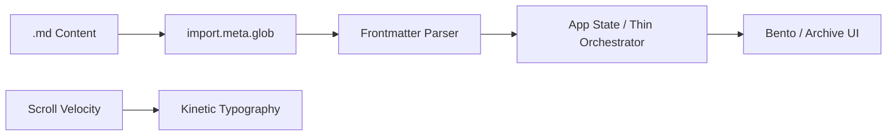

# Nicholas Yun Portfolio — The Engineered Soul (v2.0)

[](package.json)
[](package.json)
[](src/styles/index.css)
[](src/App.tsx)

> "Engineering the soul, one pixel at a time."

An avant-garde **Digital Installation** that balances **Tactile Brutalism** (visible structure, mono utility, 1px borders) with **High-End Editorial** (serif typography, extreme whitespace, cinematic motion). This project rejects generic web patterns and "AI slop" aesthetics in favor of a unique, data-driven experience built on a rigid mathematical foundation and kinetic interaction models.

---

## ⚡ Key Features

| Feature | Description |
| :--- | :--- |
| **🌀 Kinetic Typography** | Viewport-scaled headlines that dynamically change weight (200-950) based on scroll velocity. |
| **📏 The 28px Grid** | A mathematically rigid, visible background rhythm that dictates every pixel of the installation. |
| **🔳 Asymmetric Bento** | A non-linear project shelf with category-specific visual textures (Mono for Code, Serif for Poetry). |
| **🤖 Machine Mode (MX)** | A technical overlay revealing build versions, raw state data, and system logic. |
| **🖐️ Human Fingerprint** | Subtle CSS noise and grain overlays to add tactile, analog texture to the digital canvas. |
| **♿ AAA Accessibility** | High-contrast brutalism targeting WCAG AAA with full `prefers-reduced-motion` support. |

---

## 🛠️ Architecture

### Tech Stack
| Layer | Technology | Version | Purpose |
| :--- | :--- | :--- | :--- |
| **Framework** | React | 19.0 | Component-driven UI orchestrator |
| **Language** | TypeScript | 6.0 | Strict-mode type safety (`erasableSyntaxOnly`) |
| **Build Tool** | Vite | 6.3 | Zero-latency HMR and production bundling |
| **Styling** | Tailwind CSS | 4.1 | CSS-first configuration via `@theme` |
| **Routing** | Custom Hook | — | Hash-based routing for Archive Spreads |
| **Package Manager** | pnpm | >= 9 | Dependency management |

### Data Flow


---

## 📂 File Hierarchy

```text
📂 src/
├── 📄 App.tsx                # Thin orchestrator; lifts all global state
├── 📄 main.tsx               # StrictMode entry point
├── 📂 components/            # High-fidelity UI primitives (16 files)
│   ├── 📄 HeroKinetic.tsx    # Scroll-responsive typographic installation
│   ├── 📄 AboutFlow.tsx      # Asymmetric editorial layout (0.26/0.74 grid)
│   ├── 📄 BentoGrid.tsx      # Non-linear project shelf
│   ├── 📄 ArchiveSpread.tsx  # Collection grid + item detail (magazine spread)
│   ├── 📄 MachineOverlay.tsx # Technical MX debug layer
│   └── 📄 GrainOverlay.tsx   # "Human fingerprint" texture
├── 📂 hooks/                 # Interaction & system logic (3 files)
│   ├── 📄 useWeightedScroll.ts # Scroll velocity → font-weight logic
│   ├── 📄 useRouteHash.ts      # Custom hash-based router
│   └── 📄 useReducedMotion.ts  # WCAG animation gates
├── 📂 lib/                   # Data layer & types (3 files)
│   ├── 📄 content.ts         # Markdown ingestion & frontmatter parser
│   ├── 📄 types.ts           # Strict TypeScript interfaces (no enum/namespace)
│   └── 📄 data.ts            # Static definitions & social links
├── 📂 content/               # Source content (Markdown + images)
│   ├── 📂 collections/       # Archive items (7 categories, 20+ items)
│   ├── 📂 portfolio/         # Bento grid projects (14 items)
│   └── 📂 portrait/          # Hero slide portraits (4 directories)
└── 📂 styles/
    └── 📄 index.css          # Tailwind v4 @theme & 28px grid system
```

---

## 🚀 Quick Start

### Prerequisites
- **Node.js** >= 20
- **pnpm** >= 9

### Installation
```bash
pnpm install
```

### Verification & Build
```bash
# Start development server
pnpm dev

# Run strict type checking (Mandatory before commits)
pnpm typecheck

# Build for production
pnpm build

# Verify content ingestion integrity
node scripts/verify-content.test.js
```

---

## ✍️ Content Management

The portfolio is data-driven, ingesting Markdown content via `import.meta.glob`:

1. **Portfolio Items**: Place `.md` files in `src/content/portfolio/`.
2. **Collections**: Place `.md` files in `src/content/collections/[category]/`.
3. **Images**: Sibling `.jpg`/`.png`/`.webp`/`.avif` files with the same name as the `.md` are auto-associated.
4. **Portraits**: Place portrait images in `src/content/portrait/[key]/` where `[key]` matches the `portraitKey` defined in `src/lib/data.ts`.
5. **Guide Files**: Files named `PUT_*_HERE.md` are automatically excluded from rendering.

### Important: Content Location Constraint
⚠️ **All content for ingestion MUST live inside `src/content/collections/` or `src/content/portfolio/`**. Content placed at the top level of `src/content/` will **not** be ingested and will be orphaned.

### Adding a New Collection
1. Add a new entry to `collectionDefinitions` in `src/lib/data.ts`:
   ```typescript
   {
     slug: 'new-collection',
     title: 'New Collection',
     category: 'Category',
     accent: '#ff0000',
     description: 'Description here.',
     status: 'active',
   }
   ```
2. Create `src/content/collections/[slug]/`
3. Place `.md` files + sibling images
4. The collection will appear on the Archive page

---

## ⚠ Troubleshooting (Post-Remediation)

### "Content Not Appearing"
- Check that `import.meta.glob` paths in `src/lib/content.ts` point to the correct location.
- Ensure files are in `src/content/collections/[slug]/` or `src/content/portfolio/`.
- Verify `isCollectionGuideFile()` filters out any placeholder files (`PUT_*`, `README.md`).

### "Portrait Image Missing"
- Verify the `portraitKey` in `heroSlides` (in `src/lib/data.ts`) exactly matches a directory under `src/content/portrait/`.
- If a portrait is missing, the site falls back to the "NY" text placeholder.

### "Build Fails After Content Changes"
- Run `pnpm typecheck` first to isolate TypeScript errors.
- If Vite build fails, check for incorrect `import.meta.glob` relative paths (must be `../content/...` from `src/lib/`).

---

## 🎨 Design System

The installation is governed by a rigid set of design tokens in `src/styles/index.css`:

- **The Unit**: `28px` grid rhythm.
- **Borders**: `1px solid` with `0px` radius (`radius-brutal`).
- **Typography**:
  - **Editorial**: *Cormorant Garamond* (Kinetic headlines).
  - **Utility**: *IBM Plex Mono* (Labels, metadata, MX data).
  - **Body**: *Inter* (Legibility-focused reading).
- **Colors**: Hex + RGBA palette supporting both Dark (Night) and Light (Day) themes via CSS variables.

---

## ♿ Accessibility & Motion

- **WCAG AAA**: High-contrast ratios and semantic HTML are strictly enforced.
- **Motion Gates**: All kinetic interactions check `useReducedMotion()`.
- **Focus**: Global focus-visible styles provide a 3px accent outline for keyboard navigation.
- **Skip Link**: A "Skip to main content" link is available for screen readers.

---

## 🤝 Contributing

This project follows the **Meticulous Approach**:
1. **Analyze** → 2. **Plan** → 3. **Validate** → 4. **Implement** → 5. **Verify** → 6. **Deliver**

- **Strict TS**: No `any`, `enum`, or `namespace`.
- **Brutalist CSS**: No `rounded-*` classes except `rounded-none`.
- **Validation**: `pnpm typecheck` must pass with zero errors.

---

## 📜 License

MIT © Nicholas Yun. See `LICENSE` for details (if applicable).

*"Engineering the soul, one pixel at a time."*
